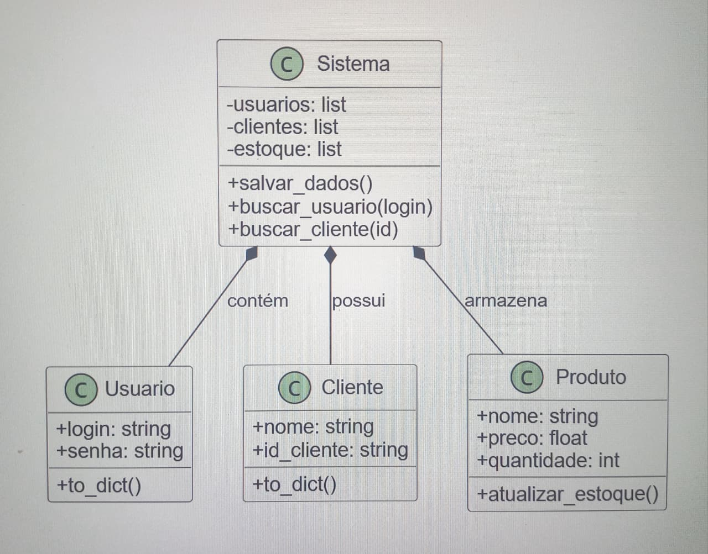
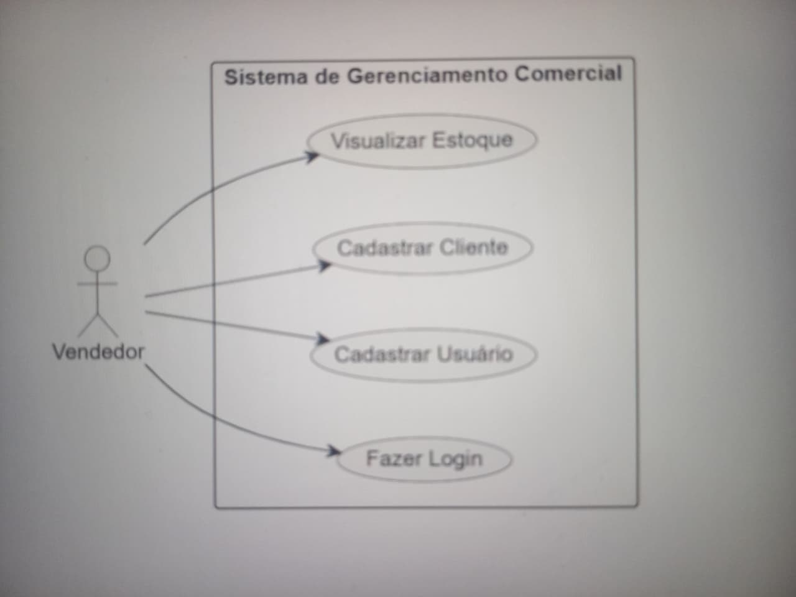
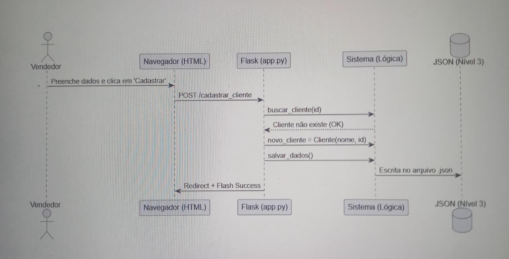

# 📊 Documentação UML

Este documento contém a modelagem do sistema de gerenciamento comercial.

## 1. Diagrama de Classes
Mostra a estrutura das entidades (Usuário, Cliente, Produto) e como a classe Sistema centraliza os dados.

## 2. Diagrama de Casos de Uso
Representa as interações do Vendedor com as funcionalidades do sistema Flask.

## 3. Diagrama de Sequência
Descreve o fluxo de dados desde o navegador até a persistência no JSON.
